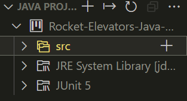
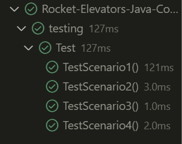

## Rocket-Elevators-Java-Controller

This program use OOP to create its structure.  
 Battery -> Columns, Floor Requests Buttons
///Column -> Elevators, Call Requests buttons
///Elevator -> Door

A scenario work by initializing a battery then, for the column it will test, it will manually change the current floor, floor requests list, direction and status of its elevator to simulate a set of elevator already working. After that, it will then launch a new request to the battery and expect the battery to pass it to the previously mentionned column and the column to pass it to the right elevator based on its algorithm. In the end it will then activate all the elevator and wait for the return of the chosen elevator and the chosen column to send to the tester.

The tester will then evaluate the state (not the attribute status) of the column and assert that all its elevator are where they should be if the algorithm was working properly.

## Dependencies

Make sure you have java installed

You must also add JAVA_HOME /path/to/Java/jdk-17.0.1 on your environement variable path.

Im not sure how the library of my java project will move to github but you should make sure that the lib JUnit5 is present in your java project.

## Testing

On vs code: when JUNIT5 is activated you should have that:

In it your should find this:

